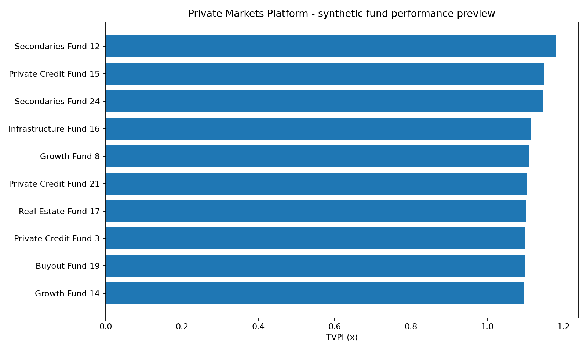

# Private Markets Investment Data Lakehouse & Document Intelligence Platform

A portfolio-grade data-engineering project modelling how fragmented private-markets data can be ingested, quality-controlled, historised, transformed into trusted investment marts and reconciled against capital-call documents.

**Core themes:** Python, SQL, private-markets data, Bronze/Silver/Gold architecture, Data Vault 2.0, Kimball modelling, data quality, reconciliation, document extraction, Databricks/PySpark deployment assets, CI and a GitHub Pages dashboard.

> **Execution status:** the full reference pipeline was executed and tested locally with Python, pandas and SQLite. Databricks/PySpark notebooks are included as deployment-ready source assets but were **not executed in a live Databricks workspace** in this build environment. The repository keeps those claims separate on purpose.

## What the verified default run produces

- **24 funds**, **180 investors** and **240 underlying assets**.
- **793 raw commitments**, **4,592 raw cashflow rows**, **438 raw NAV records** and **279 raw positions**.
- **63 deliberately invalid rows quarantined**, including duplicates, invalid currencies, orphan keys and invalid values.
- **18 NAV restatements retained** in the Data Vault historical satellite rather than overwritten.
- **4,547 valid cashflows** and **272 valid positions** in the Gold analytical model.
- **60 synthetic capital-call PDFs parsed**, with all 60 passing the typed extraction schema.
- **52 document-to-ledger matches** and **8 deliberately created mismatches** correctly routed to review.
- **18/24 funds** pass position-to-NAV reconciliation after quality filtering; **6** enter a review queue.
- **37/37 automated tests pass**.

The synthetic portfolio has a median TVPI of **1.089x**, median DPI of **0.620x**, and median computed fund-level XIRR of approximately **6.4%** in the generated demo data. Fund-level ratios remain in each fund's base currency, while portfolio monetary totals and exposure charts use an explicit synthetic FX layer to normalise GBP, USD and EUR values to GBP for comparability.

## Architecture

```text
Fund-admin CSVs + capital-call PDFs
               |
               v
            BRONZE
 immutable raw + load metadata
               |
       quality / validation
        /             \
       v               v
    SILVER         QUARANTINE
       |               |
       v               |
 DATA VAULT 2.0        |
 hubs/links/sats        |
 historical NAV        |
       |                |
       +-------+--------+
               v
         GOLD / KIMBALL
 dimensions + facts + latest valid NAV
               |
     +---------+-----------+
     |                     |
     v                     v
fund KPI / exposure   document + NAV
semantic marts        reconciliation
     |                     |
     +----------+----------+
                v
       GitHub Pages dashboard
```

See `docs/architecture.md` for the design rationale.

## Data model

### Data Vault 2.0 layer

**Hubs:** Fund, Investor, Asset  
**Links:** Fund-Investor, Fund-Asset  
**Satellites:** Fund attributes and versioned NAV history

The point of the vault is historical traceability: an NAV restatement becomes another satellite record rather than replacing the earlier reported value.

### Kimball Gold layer

**Dimensions:** Fund, Investor, Asset, Date  
**Facts:** Cashflow, Commitment, Position, NAV

Gold marts calculate DPI, RVPI, TVPI, unfunded commitments, sector/region exposure, NAV reconciliation and document review queues.

## Document intelligence

The generator creates 60 synthetic capital-call PDFs. The verified local parser uses `pypdf` to extract typed fields:

- fund / investor IDs;
- notice and due dates;
- currency;
- call amount;
- ledger reference.

The extracted record is reconciled to the referenced contribution cashflow. Eight notices are deliberately generated with amount mismatches, and the control layer routes them to review.

A `DatabricksModelServingExtractor` seam plus a Databricks notebook show where an approved LLM/Mosaic AI extraction endpoint can be inserted. The model step is **optional and unexecuted** here; deterministic validation remains mandatory after any model output.

## Databricks path

`databricks/notebooks/` contains a mirror implementation using Databricks SQL/PySpark patterns:

1. setup / Unity Catalog volume;
2. Bronze CSV ingestion to Delta;
3. Silver quality controls and quarantine;
4. Data Vault 2.0 hubs/links/satellites;
5. Kimball/semantic marts;
6. optional model-serving seam for documents.

Run `docs/databricks_runbook.md` before claiming live Databricks experience from this repository.

## Dashboard

After the pipeline runs:

```bash
python scripts/build_dashboard.py
```

Open `docs/index.html`. The dashboard is GitHub Pages-ready and includes:

- TVPI by vintage;
- sector and regional exposures;
- position-to-NAV reconciliation;
- capital-call document reconciliation;
- quarantine volumes;
- fund-level KPI table.



## Quick start

```bash
python -m venv .venv
source .venv/bin/activate  # Windows: .venv\\Scripts\\activate
pip install -r requirements.txt
python scripts/run_pipeline.py
python scripts/build_dashboard.py
pytest -q
```

Or:

```bash
make run
make test
```

## Repository layout

```text
src/                 data generation, controls, vault/gold build, PDF extraction
scripts/             reproducible local run + dashboard build
tests/               automated data-model/control tests
sql/                 modelling and control design SQL
databricks/          PySpark / Databricks SQL deployment path
data/                 reproducibly generated raw/processed/quarantine/documents
docs/                 architecture, runbook and GitHub Pages dashboard
reports/              run summary and analytical/reconciliation outputs
warehouse/            generated SQLite reference warehouse
.github/workflows/    CI and Pages deployment
```

## Why this is useful as a portfolio project

The project is intentionally more than a notebook or dashboard. It demonstrates a full data-product lifecycle: source modelling, ingestion, explicit quality gates, historical corrections, formal warehouse modelling, reconciliation, analytical semantics, testing, deployment assets and business-facing presentation.

## Limitations

- All data is synthetic.
- Portfolio-level monetary totals and exposure charts use deterministic synthetic FX rates to normalise GBP, USD and EUR to GBP; the rates are demonstration inputs rather than market data.
- The local reference implementation uses pandas/SQLite rather than a distributed engine.
- Databricks, Delta and model-serving assets were not live-executed in this environment.
- The Data Vault implementation is intentionally compact and educational; a production vault would usually include effectivity/record-source conventions, more satellites and incremental loading strategy.
- Fund-level XIRR is calculated from each fund's generated base-currency cashflows plus terminal NAV. It is a synthetic engineering demonstration rather than audited investment performance.

## CV-safe wording

> Built and verified a private-markets data platform over 4.5k+ cashflows using Python/SQL, with Bronze/Silver quality gates, Data Vault 2.0 history, Kimball marts, reconciliation controls and a GitHub Pages dashboard; quarantined 63 deliberate data-quality failures and routed 8/60 synthetic capital-call document mismatches to review. Added Databricks/PySpark deployment notebooks without claiming unexecuted cloud deployment.
